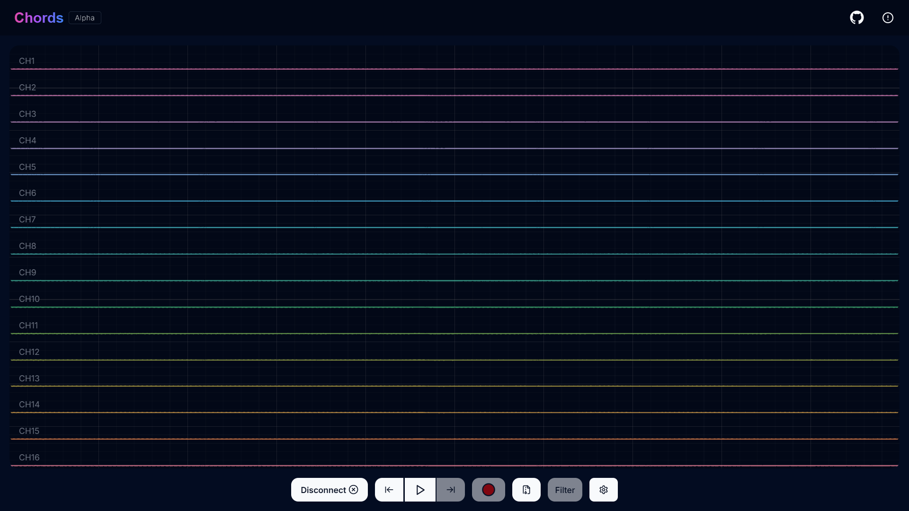

Chords is an application based on Web Serial connection, you can connect [Compatible Boards](https://github.com/upsidedownlabs/Chords-Arduino-Firmware) after uploading the ArduinoFirmware.ino code to it, you'll recieve data signals from the board which can be visualized on web using Chords. Users can visualize ECG and EMG signals.

> [!NOTE]
> Flash Arduino code to your hardware from [Chords Arduino Firmware](https://github.com/upsidedownlabs/Chords-Arduino-Firmware) to use it with Chords.

## Features

- **Connection**: Experience a smooth connection/disconnection with board in single click.
- **Real-time Visualization**: Visualize incoming data without any jitter from the board in real-time.
- ****Frame Buffer Feature**: View and save up to the last five snapshots of your data. Navigate snapshots using left/right buttons, with channel count adjustments resetting snapshots for the new configuration. Zoom in or out for a closer look!
- **Recording**: Record data indefinitely in CSV format or set a timer to automatically stop recording.
- **Download/Delete**: Manage recorded files efficiently with a popover menu to download or delete individual files from IndexedDB. Additionally, download all files as a ZIP or delete them in one click.
- **Zoom**: Control your view with zoom-in and zoom-out features for both detailed and overall views.
- **Filter**: Enhance biopotential signal quality with intuitive filter controls. Apply filters for EMG, ECG, EOG, and EEG signals using dedicated icons and the master button for all-channel application.
- **Channel**: Plot and view multiple data channels in real-time, each color-coded for easy identification.
- **Disconnect**: Easily terminate the connection to the development board with a simple click for a seamless disconnection process.

## How to use

1.  Connect the Arduino to your computer using a USB cable.
2.  Open the Arduino IDE and flash the provided firmware onto the Arduino.
3.  Open Chords in a web browser.
4.  Click the "Connect" button to establish a connection with the Arduino and stream.
5.  Click the "Zoom" button to zoom in on data visualization.
6.  Click the "Play/Pause" to control data flow and navigate frames with forward/backward buttons.
7.  Click the "Record" button to record data.
8.  Click the "download" button to download the recorded data.
9.  Click the "Delete" button to delete recorded data.
10. Click the "Plus/Minus" button to increase/decrease channel.
11. Click "Filter" button for EMG, ECG, EOG and EEG filters with muscle, heart, eye and brain icons or master buttons for all channels. You can apply 50Hz or 60Hz filter to individual or all channel.
12. Click the "Disconnect" button to terminate the connection with the Arduino and stop the data stream.

## Technologies Used

- [Next js](https://nextjs.org/): A framework build on top of React.js.
- [TypeScript](https://www.typescriptlang.org/): Statically typed superset of JavaScript.
- [Tailwind CSS](https://tailwindcss.com/): Utility-first CSS framework.
- [Shadcn UI](https://tailwindcss.com/): Provides Reusable and customizable components, built with radix UI.
- [WebGl Plot](https://webgl-plot.vercel.app/): Real time charting library.
- [IndexedDB](https://developer.mozilla.org/en-US/docs/Web/API/IndexedDB_API) Browser-based database for storing recorded data.

## Resources

- [Vendors](src/components/vendors.ts) list for board name and there vendor id are taken from [Stackblitz](https://stackblitz.com/edit/typescript-web-serial?file=vendors.ts) created by [William Grasel](https://github.com/willgm)

## Icons Used
- [Lucide React](https://lucide.dev/guide/packages/lucide-react)

## Roadmap for upcoming update

- [X] **Data Filtering** : We will be adding bio-potential signal filtering options which includes 50/60 Hz notch filter to remove AC interference noise and highpass/lowpass remove artefacts from ECG, Emg ,Eog and EEg. Under filters, we will be adding different highpass and lowpass filters for specific bio-potential signals this feature will further enhance the user experience to record even more clear biopotential signals.

- [X] **Frame Buffers of data** : We will add Frame Buffer Feature this option to show upto 5 snapshots of length each of 4 seconds, you can now view upto last five snapshots of your data and save them as images.

- **Enhance Recording Experience** : Improve reacording feature 
  - [X] **Multiple file download support** : We’re excited to enhance your options for downloading recorded data! Currently, you can record a file and choose to save or delete it. Soon, you’ll be able to download multiple files at once and have the flexibility to download or delete individual recorded files as needed.
  - [ ] **Improve Recording Functionality** : Resolve delays in updating the canvas count to ensure the downloaded file shows accurate values instantly. Ensure smooth recording performance for durations exceeding 5 minutes without any lag or errors.

- [X] **CSV compatibility with [Chords Python](https://github.com/upsidedownlabs/Chords-Python)** : we will update the CSV data format and file names for both chords-web and chords-python so that you can use csvplotter.py to easily plot the recorded data.
      
- [X] **Implemented Web-worker for Indexeddb** : We will implement web worker for IndexedDB operations, for better data visualization.
      
-  **Board Support**: Add support for the following boards
    - [X] **Arduino Uno R4 WiFi Support**: Add support for Arduino Uno R4 WiFi.
    - [X] **Giga R1 Support**: Add support for the Arduino Giga R1 board with its 16-bit ADC, offering a range of 0 to 65,535.
    - [X] **Raspberry Pi Pico Support**: Release Raspberry Pi Pico support for Chords. It works seamlessly with the new Heart BioAmp Candy. Share your favorite board in the comments, and we'll aim to include it in future updates.
    - [ ] **Arduino Nano Support** Add support for Nano board which supports up to 8 channels.

## Contributors

Thank you for contributing to our project! Your support is invaluable in creating & enhancing Chords-Web and making it even better. 😊

